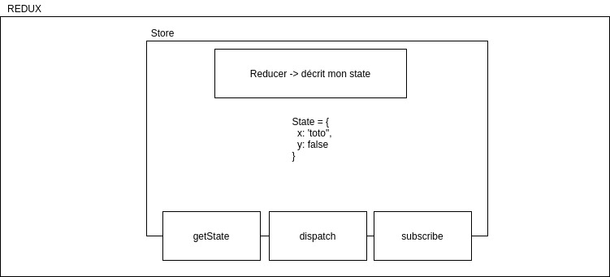

# Redux

Pour les malades qui veulent essayer de relier redux à react par eux même:
https://www.codementor.io/@rajjeet/step-by-step-how-to-add-redux-to-a-react-app-11tcgslmvi

C'est une libraire JS qui permet de gérer un state. 

Redux nous fourni un "store". Pour fabriquer le store, redux me fourni UNE fonction 'createStore'. En exécutant cette fonction, j'obtiens le store. 
Pour que mon store sache à quoi doit ressembler le state, je dois donner à createStore une fonction -> reducer.

## Reducer

Un reducer est TOUJOURS une fonction. Son rôle est de décrire à quoi doit ressembler mon state. Qu'il s'agisse du state initial, ou du state qui a évolué, c'est TOUT LE TEMPS dans cette fonction que je décris ce que je veux obtenir.

## Store

Un objet JS qui me permet d'interagir avec le state

* consulter le state (getState)
* modifier le state (dispatch)
* s'abonner aux changements de state (subscribe)
  -> Etre prévenu dés que le state a changé

### getState

A chaque fois que j'exécute cette fonction, j'obtiens le state tel qu'il est à cet instant.

### dispatch

Si je veux changer mon state, je dois dispatcher (envoyer) une action à mon reducer pour qu'il change le state en fonction.

### action

Un simple objet javascript, ayant au minimum une propriété "type" qui décrit mon intention.
Le reducer reçoit tous les objets d'action, examine leurs .type, et décide quoi faire du state en fonction. Je peux également si besoin mettre d'autres données en plus du type dans l'objet d'action (par exemple une couleur ou un texte précis à mettre dans le state).

### action creators

Je vais stocker tous les types d'actions qui existent dans une variable. Comme je pourrais me servir de cette variable partout où j'en ai besoin.

-> A l'endroit où je fabrique l'objet d'action
-> Dans le reducer où je cherche à réagir aux types d'actions

une fonction qui me return un objet d'action formatté comme il faut (avec le bon type dedans). Si mon action a besoin de transporter de la data jusqu'au reducer, je peux stocker cette data dans l'objet d'action dans une propriété de mon choix.

PAR CONVENTION, on met généralement les datas dans une propriété appelée "payload", ça permet de ne pas avoir à se poser de questions dans le reducer pour savoir quel est le nom de la propriété qui contient ce dont j'ai besoin.

On peut traduire payload par "charge utile".